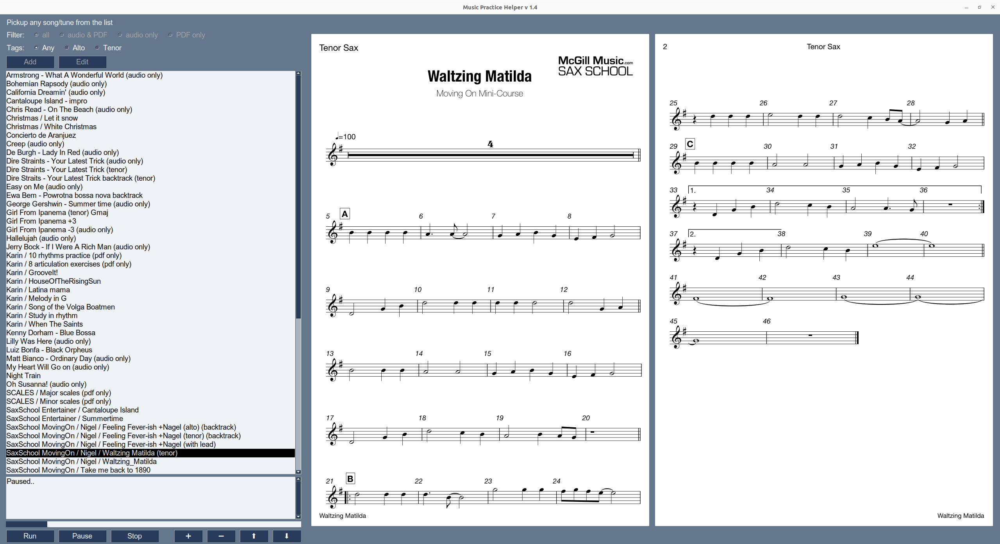

# Music Practice Helper

The application helps to practice playing an instrument.
It allows to run audio backtracks and open associated PDF documents with notes.

## Database

File locations are configured in json file `documents.json`. The app search for the file in the following order:
* current working directory
* `$HOME/.music-practise/` (hidden sub-folder in you home folder)

Take a look into `./documents.json` to see the expected syntax of the file.  

## Functionality

Filtering the content by:
* Audio with associated PDF documents
* Audio only
* PDF only

Tags:
* alto sax
* tenor sax

Playing control:
* Play
* Pause
* Stop
* Progress bar

PDF viewer:
* Next, prev page (`PgDn`/`PgUp` or `+`/`-`)
* Zoom in/out (`*` / `/`)
